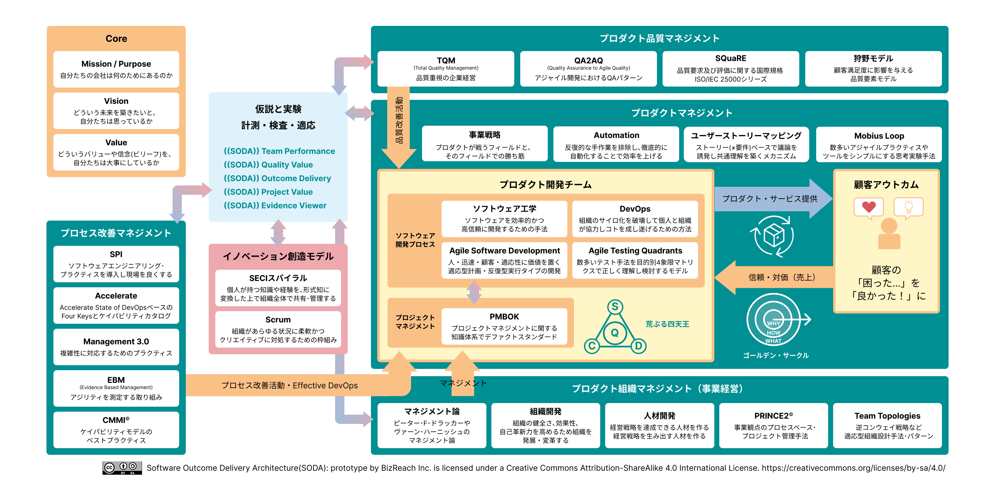

# SODA.dev

以下の図は2パターンあります。タブで切り替えてご覧ください。

=== "SODA (rev.01)"
{ loading=lazy }

<small>全体の構造を俯瞰する図。各領域の関係性を一望できます。</small>

=== "SODA Prototype (rev.02)"
{ loading=lazy }

<small>プロトタイプ構成の図。実務フローや改善ループの観点で利用できます。</small>
