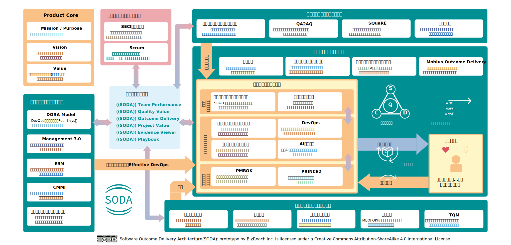
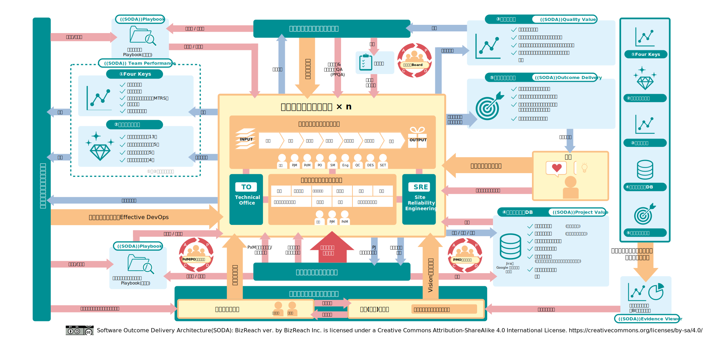

# SODA.dev

以下の図は2パターンあります。タブで切り替えてご覧ください。

=== "SODA knowledge map (ver.1.0)"

    { loading=lazy }

    <small>プロトタイプ構成の図。実務フローや改善ループの観点で利用できます。</small>

=== "SODA circulation model (rev.01)"

    { loading=lazy }

    <small>全体の構造を俯瞰する図。各領域の関係性を一望できます。</small>

---

## 変更履歴

📁 過去のバージョンを表示

 
<h3>SODA knowledge map</h3>
<ul>
<li><strong>ver.1.0</strong> (現在) - 最新版</li>
<li><strong>rev.02</strong> - 旧バージョン → <a href="images/SODA_prototype/rev.02.svg" target="_blank">画像を表示</a></li>
</ul>

<h3>SODA circulation model</h3>
<ul>
<li><strong>rev.01</strong> (現在) - 最新版</li>
</ul>
 

📋 <a href="changelog">詳細な変更履歴を見る</a>

   
