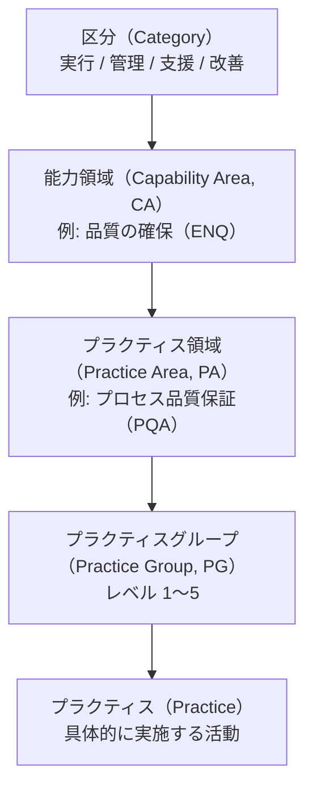

# CMMI（Capability Maturity Model Integration）

## 概要

CMMI（Capability Maturity Model Integration、能力成熟度モデル統合）は、組織のプロセス能力（capability）と成熟度（maturity）を評価し、継続的に改善するためのフレームワークです。米カーネギーメロン大学のソフトウェア工学研究所（Software Engineering Institute, SEI）が1990年代に開発し、その後CMMI Instituteを経て、2016年以降は **[ISACA](https://www.isaca.org/)** がその知的財産と運営を引き継いでいます。

CMMIは単なるチェックリストではなく、「組織として何を、どの水準で実践しているか」を **プラクティス領域（Practice Area, PA）** の集合と達成レベルで記述するモデルです。最新版は2023年4月にリリースされた **[CMMI v3.0](https://cmmiinstitute.com/cmmi/v3)** で、開発・サービス・データ・人材・セキュリティ・セーフティ・供給者・バーチャル作業の **8つのドメイン** を統合的に扱える設計になっており、ISO・NIST・アジャイル・DevSecOps・AIなど他の標準や手法とも統合・連携できることがISACA公式に明示されています。世界では14,000以上の評定済み組織がCMMIを活用し、ビジネス目標の設定・達成を報告しています（ISACA / CMMI Institute, 2025）。

CMMIの主な用途は次の3つです。

- **プロセス改善のロードマップ** — 組織が次に取り組むべき改善項目を、プラクティス領域と成熟度レベルの観点から特定する
- **ベンチマーク** — 公式アプレイザルによって、業界・他組織との位置づけを比較する
- **調達要件・契約要件** — 米国防総省（DoD、2025年9月以降の対外呼称はDepartment of War; Trump, 2025）系の歴史的な調達要件として、また大規模アウトソーシング契約におけるサプライヤー評価基準として利用されてきた

---

## 歴史と進化

CMMIの系譜は、1980年代後半のSW-CMM（Capability Maturity Model for Software）に遡ります。米国防総省がソフトウェア調達におけるサプライヤー評価のためにSEIに委託したことが起点です。

| 年 | 出来事 |
|---|---|
| 1991 | SW-CMM（ソフトウェア向けCMM）v1.0が公開される |
| 2002 | 複数のCMM（ソフトウェア、システム工学、IPPDなど）を統合した **CMMI v1.1** が公開される |
| 2006 | CMMI v1.2 — Development、Services、Acquisitionの3コンステレーションに整理 |
| 2010 | CMMI v1.3 — アジャイル開発との親和性に関する補足が追加 |
| 2016 | ISACAがCMMI Instituteを買収し、運営を引き継ぐ |
| 2018 | **CMMI v2.0** — プラクティス領域／プラクティスグループの構造へ刷新、パフォーマンス（Performance）志向を強化 |
| 2020 | DoDが **Software Acquisition Pathway**（DODI 5000.87）を制定し、ソフトウェア調達の主流をAgile / DevSecOpsへ転換 |
| 2023 | **CMMI v3.0**（2023年4月）— ドメイン／ビューの拡張、デジタル変革・サイバーセキュリティ・データ管理への対応強化 |

CMMIは「品質・コスト・スケジュールの予測可能性を高め、組織のパフォーマンスを継続的に改善する」という一貫したテーマのもとで進化してきました。v2.0以降は **パフォーマンスとビジネス成果との結びつき** を強調し、アジャイル／DevOpsとも矛盾しない枠組みとして再定義されています。

一方、CMMIには実務面で繰り返し指摘されてきた批判があります。代表的なものは次の3点です。

- **アジャイル／DevOpsの価値観との衝突** — アジャイル宣言の「プロセスとツールより個人と対話を、計画への追従より変化への対応を」という原則と、CMMIが要求するプロセス標準化が緊張関係を生む（Boehm & Turner, 2004; Fritzsche & Keil, 2007; Ferdinansyah & Purwandari, 2021）
- **目的の倒錯（ゲーミング）** — 組織がプロセス改善そのものではなく「レベルNを取ること」を目的化しやすく、結果として現場の改善より審査対応が優先される。CMMI評定の不正対策として **CACAIA**（Certification and Appraisal Compliance Agency Integrity Assurance）が設立されている事実が、この問題の存在を制度面から裏づける（CACAIA, n.d.; University of Edinburgh SAPM Course Blog, 2014）
- **チーム自律性の制約** — ML3以上では組織横断の標準プロセスが要求されるため、チームごとに最適な働き方を選びにくくなる（University of Edinburgh SAPM Course Blog, 2014）

CMMIはv2.0以降、アジャイル／DevOpsと矛盾しない設計を明示することでこれらの批判に応えてきました。そもそも、こうした批判の多くは「**評定レベルの取得を目的化した運用**」に向けられたものであって、CMMIが体系化した個別のプラクティス（要求の開発と管理、構成管理、リスクと機会の管理、ピアレビュー、プロセス品質保証など）そのものの有効性が損なわれているわけではありません。Benchmark Appraisalを **メダル取り** として競う時代は事実上終わりつつありますが、CMMIを **組織開発のための包括的なベストプラクティス集** として参照すれば、自組織の能力を体系的に診断し、プロセス資産（テンプレート・手順・教育プログラム）を整備するための強力な手引きになります。「レベル評定で競う対象」ではなく「**組織能力を俯瞰するためのリファレンス**」として活用する——これが、批判を踏まえた現代的なCMMIの使い方と言えるでしょう。

一方、ソフトウェアデリバリーの日常的な改善判断という用途では、**チーム単位で測定・改善できる** 後発モデル（[DORA Core Model](pim-dora-core-model-detail.md)など）が広く使われるようになっています。

### モデルドキュメントの入手方法（v1.3までは無料、v2.0以降は有償）

CMMI v1.3までのモデル本文はSEIのWebサイトから **PDFとして無料で公開** されており、現在も[SEIのライブラリ](https://resources.sei.cmu.edu/library/)からレガシー資料として参照できます。

一方、**CMMI v2.0（2018年）以降はモデル本文がISACAの有償ライセンス制** に移行しました。モデル本体にアクセスするには[CMMI Online Model Viewer](https://cmmiinstitute.com/products/cmmi/content-release)の年次サブスクリプションまたはEnterprise Licenseの購入が必要で、PDF版も有償ライセンスに含まれる形で提供されます。最新版のv3.0も同じ有償提供方式です。

このため、組織内でモデル本文をそのまま配布したり、社外のドキュメントに本文を引用したりする場合は、ライセンス条項の確認が必須です。本ページのような **概要・解説** はISACAが公開している[Quick Reference Guide](https://www.isaca.org/resources/reference-guide/cmmi-model-quick-reference-guide)など、無償で公開されている二次資料に基づいて構成しています。

---

## モデルの構造

CMMI v3.0のアーキテクチャは、上位から下位に向かって **区分 → 能力領域 → プラクティス領域 → プラクティスグループ → プラクティス** の階層で整理されています。

各プラクティス領域には **「中核（Core）」とドメイン特化** の区別があり、中核PAは組織のドメインを問わず共通に必要な能力、ドメイン特化PAは開発・サービス・セキュリティなど特定ドメインで必要な能力を扱います。

### プラクティス領域（Practice Area, PA）

類似したプラクティスの集合で、その領域で定義された **意図（Intent）** と **価値（Value）** を達成する単位です。CMMI v3.0には **31のプラクティス領域** があり、識別子（略号）と意図・価値で整理されています。代表例：

| PA | 略号 | 意図 |
|---|---|---|
| プロセス品質保証 | PQA | 実施されたプロセスと成果物の品質を検証し、品質改善を可能にする |
| 構成管理 | CM | 構成の特定・バージョン管理・変更管理・監査により、作業成果物の一貫性を管理する |
| 検証と妥当性確認 | VV | ソリューションが要件を満たし、対象環境で意図どおり機能することを実証する |
| 要件の開発と管理 | RDM | 要件を引き出し、利害関係者の共通理解を確認し、計画・成果物と整合させる |
| 計画 | PLAN | 組織の標準と制約のなかで、作業を達成するために必要なことを記述する計画を作成する |
| 監視と制御 | MC | 計画からの逸脱を理解し、是正処置をとれるようプロジェクトの進捗を可視化する |
| 見積もり | EST | ソリューションの開発・取得・提供に必要な作業と資源の規模・工数・期間・費用を見積もる |
| リスクと機会の管理 | RSK | 潜在リスク・機会を特定・記録・分析・管理する |
| 統治 | GOV | 実績・プロセスにおけるスポンサーシップと統治の役割について上級管理層に手引きを提供する |
| 実装のインフラ | II | 組織の重要なプロセスと資産が習慣的・持続的に遵守・改善されるようにする |

### プラクティスグループ（Practice Group, PG）

各プラクティス領域は **レベル1〜5** のプラクティスグループを持ちます。レベルは進化的かつ段階的で、レベル2はレベル1のすべてのプラクティスを完全に包含し、レベル3〜5はそれぞれ前のレベルを基盤として構築されます。上位レベルを完全に満たすには、下位レベルが適切に実施されていることが前提です。

### 能力領域（Capability Area, CA）

複数のプラクティス領域を、ビジネス目的の観点でまとめた区分です。CMMI v3.0の能力領域は次のとおりです：

| 能力領域 | 略号 | 主な対象 |
|---|---|---|
| 品質の確保 | ENQ | PQA、ピアレビュー、検証と妥当性確認、要件の開発と管理 |
| 実施の支援 | SI | 構成管理、原因分析と解決、決定分析と解決 |
| 実績の改善 | IMP | 実績と測定の管理、プロセス資産開発、プロセス管理 |
| 作業の計画と管理 | PMW | 計画、見積もり、監視と制御 |
| 事業レジリエンスの管理 | MBR | 継続、インシデントの解決と予防、リスクと機会の管理 |
| 習慣と持続性の維持 | SHP | 統治、実装のインフラ |
| 人材の管理 | MWF | 組織トレーニング、従業員のエンパワーメント、バーチャル作業の支援 |
| データの管理 | MD | データ管理、データ品質 |
| セキュリティとセーフティの管理 | MSS | セキュリティの支援、セキュリティの脅威と脆弱性の管理、セーフティの支援 |
| サービスの提供と管理 | DMS | サービス提供管理、戦略的サービス管理 |
| 供給者の選定と管理 | SMS | 供給者合意管理 |
| 成果物のエンジニアリングと開発 | EDP | 技術ソリューション、成果物統合 |

### 区分（Category）

能力領域をさらに高い視点でまとめた4つの区分です。

| 区分 | 主な関心事 |
|---|---|
| **実行（Doing）** | 製品やサービスを作って届ける活動そのもの |
| **管理（Managing）** | 計画、リスク、人材、事業継続などの管理活動 |
| **支援（Enabling）** | プロセス改善やインフラなど、現場活動を支える活動 |
| **改善（Improving）** | 実績測定とプロセス改善 |

### ドメイン（Domain）

CMMI v3.0では、組織の関心領域に応じて関連するプラクティス領域の組み合わせを **8つのドメイン** として提供します。

| ドメイン | 略号 | 能力の説明 |
|---|---|---|
| データ | DATA | データおよびデータ品質の統治と管理 |
| 開発 | DEV | ハードウェア、ソフトウェア、関連構築要素を含む製品・ソリューションの作成 |
| ピープル | PPL | 人員の開発、定着、目標達成の実現 |
| セーフティ | SAF | 安全な製品・サービス・その他のソリューションの提供と維持 |
| セキュリティ | SEC | 重要な防衛策の特定と強化、脅威に対する回復力の強化 |
| サービス | SVC | 活動や作業で構成される無形のソリューションの構築と提供 |
| 供給者 | SPM | 製品・サービス等を供給する会社・組織・個人の管理 |
| バーチャル | VRT | 遠隔地からの製品・サービス等の提供 |

ドメインは独立して評価することも、複数を組み合わせることもできます。たとえば「開発 + セキュリティ」の組み合わせで、セキュアな製品開発の能力を評価できます。

---

## プラクティスグループレベルと成熟度レベル

CMMI v3.0では、達成度を表現する2つの軸があります。**プラクティスグループレベル** は個別のプラクティス領域ごとの達成度、**成熟度レベル** は組織単位（OU）全体の達成度を表します。

### プラクティスグループレベル（Practice Group Level）

各プラクティス領域内で、どこまでのプラクティスを実施できているかを表す **1〜5** のレベルです。連続的に積み上がる構造で、上位レベルは下位レベルのすべてを包含します。

| レベル | 名称 | 状態 |
|---|---|---|
| **レベル1** | 初期の（Initial） | プラクティス領域の意図を満たすための初期のアプローチ。完全なプラクティスの集合ではないが、実績の課題に取り組み始める |
| **レベル2** | 管理された（Managed） | レベル1を包含。PAの全ての意図を取り上げる、単純であるが完全なプラクティスの集合。組織資産の使用は不要。プロジェクトの実績目標に向かって進捗を定義し監視する |
| **レベル3** | 定義された（Defined） | レベル2の上に構築。組織標準やテーラリングを用いてプロジェクトや作業の特性を取り上げる。プロジェクトは組織の資産を用い、資産に貢献する。プロジェクトと組織の両方の実績目標に集中する |
| **レベル4** | 定量的に管理された（Quantitatively Managed） | レベル3の上に構築。統計的・定量的技法で実績の変動を理解し、「品質およびプロセス実績の目標（QPPO）」を達成する |
| **レベル5** | 最適化している（Optimizing） | レベル4の上に構築。統計的・定量的技法で組織全体の実績と改善を最適化する |

### 成熟度レベル（Maturity Level, ML）

組織単位（OU）におけるプロセスが、あらかじめ定義されたプラクティス領域と指定されたプラクティスグループレベルの **意図と価値をどの程度満たしているか** を示すものです。**段階的（staged）表現** と呼ばれ、組織横断のベンチマークでよく用いられます。ML1〜ML5は上記プラクティスグループレベルの段階に対応します。

!!! info "成熟度レベル達成の意味"
    成熟度レベルNを達成するには、対象となるすべてのプラクティス領域について、レベルNまでのプラクティスグループのプラクティスをすべて満たす必要があります。たとえばML3達成には、ML2とML3の両方のプラクティスが組織全体で機能していなければなりません。

!!! tip "段階的vs連続的"
    伝統的にCMMIは段階的表現（成熟度レベル）が有名ですが、ビジネス上の優先課題に応じて特定のプラクティス領域だけを伸ばしたい場合は **能力レベル評定（Capability Level Appraisal）** という連続的表現の評定形式も利用できます。v2.0以降、両者を併用する組織が増えています。

---

## アプレイザル（評価）

CMMIの達成度は、訓練を受けた **Lead Appraiser** が主導する公式の評価活動である **Appraisal** によって判定されます。評価はインタビュー、文書レビュー、現場観察などのエビデンスに基づき、客観的に行われます。

CMMI v2.0以降の主なアプレイザル種別は次のとおりです。

| アプレイザル種別 | 目的 |
|---|---|
| **Benchmark Appraisal** | 成熟度レベル（ML）または能力レベル（プラクティスグループレベル単位）の公式評定。最大3年間有効 |
| **Sustainment Appraisal** | Benchmarkの有効期間を延長するための再評価 |
| **Evaluation Appraisal** | 改善活動の進捗を内部的に確認するための簡易評価 |
| **Action Plan Reappraisal** | 不適合事項の是正後に、特定領域だけを再評価する |

評価結果はISACAの **PARS（Published Appraisal Results System）** に登録され、外部から参照可能です。多くの調達契約やRFP（提案依頼書）で「ML3以上」「Benchmark Appraisalの有効な認定保持」といった要件が課されるため、結果の公開性がCMMIの重要な特徴になっています。

---

## 実践への適用

### 改善活動のロードマップとして使う

CMMIの最も有効な使い方は、組織のプロセス改善を「いきあたりばったり」ではなく、構造化された段階で進めるためのロードマップとしての活用です。たとえば次のような流れで運用します。

1. **現状把握** — Evaluation Appraisalや自己診断で、各プラクティス領域の達成度を確認する
2. **ターゲット設定** — ビジネス目標に直結する能力領域を選び、どのプラクティス領域をどのレベルまで引き上げるかを決める
3. **ギャップ分析** — 現状とターゲットの差を、プラクティスグループ単位で洗い出す
4. **改善実装** — プロセス資産（テンプレート、手順、ツール）の整備とトレーニングを行う
5. **再評価** — 一定期間後に再度評価し、改善効果を測定する
6. **定着** — プロセス資産を組織標準として共有し、新規プロジェクトへ展開する

### 調達要件・契約要件として使う（歴史的役割と現状の変化）

歴史的にはDoDの **Gansler Memo（1999年）** 以降、ACAT I級の大規模ソフトウェア調達で「CMMI ML3を保持していること」が事実上の入札条件となっており、CMMIは **市場参入の門番（gatekeeper）** としての役割を持っていました。

一方、2020年の **[Software Acquisition Pathway（DODI 5000.87）](https://www.esd.whs.mil/Portals/54/Documents/DD/issuances/dodi/500087p.PDF)** 制定以降、DoDのソフトウェア調達の主流はAgile / DevSecOpsへ移行し、サイバーセキュリティ領域は別途 **[CMMC（Cybersecurity Maturity Model Certification）](https://www.acquisition.gov/dfars/252.204-7021-cybersecurity-maturity-model-certification-requirements.)** がDFARSで義務化されました（2024年最終規則、2025年11月施行）。CMMIは現在、DoDの中心的な調達要件ではなくなり、主にインド・中国を中心とするアウトソーシング業界や、一部のITサービス調達で求められる位置づけに変化しています。

その結果、米国市場での新規アプレイザル件数は減少傾向にある一方、グローバル全体では2024年も4,500件超のアプレイザルが実施されており、海外（特にアジア）のSI/オフショア企業が需要を下支えしている構造です（Sync Resource, 2024）。

### 組織横断の共通言語として使う

複数事業部・複数地域に分かれた組織では、品質・プロセスの議論が部門ごとにバラバラの語彙で行われがちです。CMMIのプラクティス領域と成熟度レベルは、こうした議論を **共通の地図** に落とし込むための語彙として機能します。

---

## 現代のソフトウェア開発との関係

CMMIは歴史的に「ウォーターフォール型／重厚な文書化を前提としたモデル」と誤解されることがありました。実際にはCMMIは **何を達成すべきか（What）** を定義するモデルであり、**どう達成するか（How）** は組織が選択できます。アジャイル、リーン、DevOpsといった手法は、CMMIのプラクティスを満たす実装手段として位置づけられます。

### アジャイル／DevOpsとの接続

- **Continuous Integration / Continuous Delivery** は、CMMIの **構成管理（CM）**、**検証と妥当性確認（VV）**、**実装のインフラ（II）** のプラクティスを高い水準で満たす実装パターンとして解釈できる
- **スクラムのスプリントレビュー／レトロスペクティブ** は、CMMIの **プロセス品質保証（PQA）** や **実績の改善（IMP）** 能力領域の改善活動として整理できる
- **DevOpsのFour key metrics（DORA）** は、CMMIの **定量的に管理された（レベル4）** で求められるプロセス実績指標の現代的な実装と捉えられる
- ISACA公式リファレンスでも、CMMIが **ISO・NIST・アジャイル・DevSecOps・AI** などの他標準・手法と統合・連携できることが明示されている

### PMBOKとの違い

CMMIと **[PMBOK Guide](https://www.pmi.org/standards/pmbok)（Project Management Body of Knowledge、PMIが発行するプロジェクトマネジメントの知識体系）** は、どちらも「組織やプロジェクトの進め方を整える」ためのフレームワークとして並べて語られがちですが、**そもそも対象とする層が異なります**。

| | CMMI | PMBOK Guide |
|---|---|---|
| 発行元 | ISACA（旧CMMI Institute） | PMI（Project Management Institute） |
| 評価の単位 | **組織**のプロセス能力・成熟度 | **プロジェクト**を進めるための知識・実務体系 |
| 主な対象者 | 組織（経営・プロセス改善担当） | プロジェクトマネージャー（個人） |
| 認定 | 組織への **Benchmark Appraisal**（ML1〜ML5） | 個人への **PMP** などの資格認定 |
| カバー範囲 | 開発・サービス・調達・人材・セキュリティ等の組織能力 | プロジェクト管理の知識体系（第8版、2025年11月）: 6原則＋7パフォーマンスドメイン＋5フォーカスエリア（40プロセス）（Learning Tree, 2026） |
| 答える問い | 「この組織は再現性のある仕事ができるか？」 | 「このプロジェクトをどう進めるか？」 |

両者は **競合ではなく階層が違う** 関係にあります。たとえば「CMMI ML3を取得した組織で、PMP資格を持つPMがプロジェクトを進める」という形で同時に成立します。CMMIが定めるのは **組織標準プロセス（Organizational Standard Processes）の存在と運用** であり、PMBOKが定めるのは **個別プロジェクトの計画・実行・監視のノウハウ**です。

### CMMIとDORAの補完関係

CMMIと[DORA Core Model](pim-dora-core-model-detail.md)は、いずれもソフトウェア開発組織の能力を扱う代表的なモデルですが、**粒度と目的が異なる補完的なモデル** であり、競合関係にあるわけではありません。

| | CMMI | DORA Core Model |
|---|---|---|
| 主な関心 | 組織のプロセス能力・成熟度 | ソフトウェアデリバリーのケイパビリティとパフォーマンス |
| 達成度の表現 | ML1〜ML5（成熟度レベル）／プラクティスグループレベル1〜5 | Four key metricsをElite / High / Medium / Lowの4段階で区分 |
| 評価方法 | 公式アプレイザル | セルフアセスメント（Quick Check）と研究ベースのベンチマーク |
| 主な利用シーン | 調達、組織改善、長期的成熟度向上 | 日々のデリバリー改善、エンジニアリング投資判断 |

規制が強い業界や調達要件としてCMMIの達成度が求められる場面ではCMMIを、エンジニアリングの日常的な改善判断にはDORAを、というように使い分け／併用するのが現実的なアプローチです。

---

## 参考文献 {#references}

- Boehm, B., & Turner, R. (2004). *Balancing agility and discipline: A guide for the perplexed*. Addison-Wesley Professional.
- Carnegie Mellon Software Engineering Institute. (2010). *CMMI for development, version 1.3* (Technical Report CMU/SEI-2010-TR-033). https://resources.sei.cmu.edu/library/asset-view.cfm?assetid=9661
- Carnegie Mellon Software Engineering Institute. (n.d.). *Software Engineering Institute*. Retrieved April 28, 2026, from https://www.sei.cmu.edu/
- Certification and Appraisal Compliance Agency Integrity Assurance. (n.d.). *Home*. Retrieved April 28, 2026, from https://cacaia.org/
- Ferdinansyah, A., & Purwandari, B. (2021). Challenges in combining agile development and CMMI: A systematic literature review. In *Proceedings of the 2021 10th International Conference on Software and Computer Applications (ICSCA 2021)*. Association for Computing Machinery. https://doi.org/10.1145/3457784.3457803
- Fritzsche, M., & Keil, P. (2007). Agile methods and CMMI: Compatibility or conflict? *e-Informatica Software Engineering Journal*, *1*(1), 9–26. https://www.e-informatyka.pl/index.php/einformatica/volumes/volume-2007/issue-1/article-1/
- ISACA. (n.d.-a). *CMMI* [Credentialing page]. Retrieved April 28, 2026, from https://www.isaca.org/credentialing/cmmi
- ISACA. (n.d.-b). *CMMI Model Quick Reference Guide*. Retrieved April 28, 2026, from https://www.isaca.org/resources/reference-guide/cmmi-model-quick-reference-guide
- ISACA. (n.d.-c). *How do I access the CMMI V2.0 model?* [Support article]. Retrieved April 28, 2026, from https://support.isaca.org/s/article/How-do-I-access-the-CMMI-V2-0-model-1598331746260
- ISACA / CMMI Institute. (n.d.-a). *CMMI Online Model Viewer*. Retrieved April 28, 2026, from https://cmmiinstitute.com/products/cmmi/content-release
- ISACA / CMMI Institute. (n.d.-b). *CMMI Performance Solutions*. Retrieved April 28, 2026, from https://cmmiinstitute.com/
- ISACA / CMMI Institute. (n.d.-c). *CMMI v3.0 release notes*. Retrieved April 28, 2026, from https://cmmiinstitute.com/cmmi/v3
- ISACA / CMMI Institute. (n.d.-d). *Published Appraisal Results System (PARS)*. Retrieved April 28, 2026, from https://cmmiinstitute.com/pars
- ISACA / CMMI Institute. (2025). *CMMIモデルクイックリファレンスガイド（日本語版、CMMI V3.0）*. https://cmmiinstitute.com/resources
- Learning Tree. (2026). *PMBOK Guide 8th edition: Key changes (2026 update)*. https://www.learningtree.com/blog/pmbok-guide-8th-edition-whats-new/
- Sync Resource. (2024). *The future of CMMI appraisal and its implications in 2024*. https://sync-resource.com/cmmi-appraisals/
- Trump, D. J. (2025, September 5). *Restoring the United States Department of War* (Executive Order No. 14347). The White House. https://www.whitehouse.gov/presidential-actions/2025/09/restoring-the-united-states-department-of-war/
- Turner, R., & Jain, A. (2002). Agile meets CMMI: Culture clash or common cause? In D. Wells & L. Williams (Eds.), *Extreme Programming and Agile Methods — XP/Agile Universe 2002* (Lecture Notes in Computer Science, Vol. 2418, pp. 153–165). Springer. https://doi.org/10.1007/3-540-45672-4_15
- University of Edinburgh SAPM Course Blog. (2014, February 14). *The capability maturity model: Not so capable…*. https://blog.inf.ed.ac.uk/sapm/2014/02/14/the-capability-maturity-model-not-so-capable/
- U.S. Department of Defense. (2020). *Operation of the software acquisition pathway* (DOD Instruction 5000.87). https://www.esd.whs.mil/Portals/54/Documents/DD/issuances/dodi/500087p.PDF

---

## 著作権・商標について

- **CMMI®** および **Capability Maturity Model Integration®** は、米[ISACA](https://www.isaca.org/)およびその子会社である **CMMI Institute, LLC** の登録商標です。
- CMMIモデルの本文・図表・アーキテクチャ等の各種コンテンツに関する著作権、商標、その他一切の知的財産権は **© 2025 CMMI Institute, LLC. All rights reserved.** に帰属します。
- CMMI Institute, LLCの書面による明示的な許可なく、CMMI Contentの複製、複写、販売、譲渡、派生著作物の作成、ソフトウェアやツールへの組込み、商業的利用を行うことはできません。
- 本ページはISACA / CMMI Instituteが公式に無償公開している[CMMIモデルクイックリファレンスガイド](https://www.isaca.org/resources/reference-guide/cmmi-model-quick-reference-guide)（日英）および公開ガイダンス類に基づく **概要・解説** であり、CMMIモデル本文の代替として利用することを意図したものではありません。CMMIモデルそのもの（プラクティスの完全な記述、必要情報、解説情報、活動の例、作業成果物の例、コンテキスト固有情報等）の参照・採用・評定・トレーニング目的での利用には、[CMMI Online Model Viewer](https://cmmiinstitute.com/products/cmmi/content-release)の正規ライセンス購入が必要です。
- CMMIに関する用語の日本語表記は、ISACA / CMMI Instituteが公開する公式日本語版資料に準拠しています。
